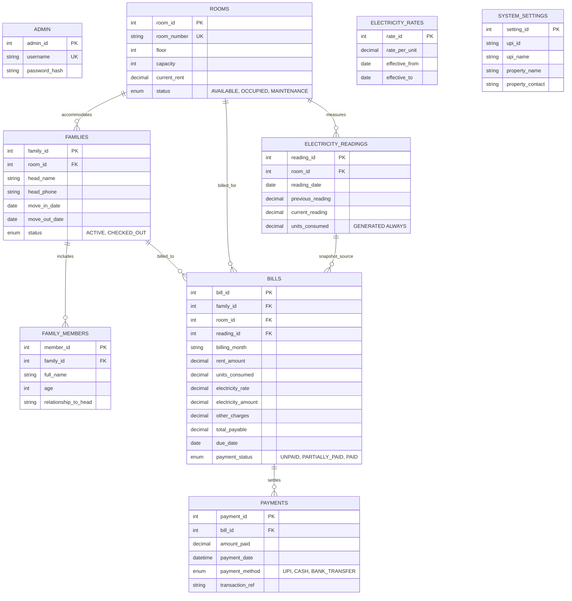

<div align="center">

  

  # 🏠 NIVARA
  ### **Rental Accommodation & Family Billing Management System**

  A comprehensive, production-grade DBMS web application built with **Flask**, **MySQL (InnoDB)**, and a modern **Slate & Emerald SaaS UI**. Designed for landlords and property managers to streamline room allocations, automate 30-day electricity billing cycles, record immutable invoice snapshots, generate local UPI QR payment codes, and produce PDF receipts.

  <br/>

  [](https://www.python.org/)
  [](https://flask.palletsprojects.com/)
  [](https://www.mysql.com/)
  [](https://getbootstrap.com/)
  [](https://www.reportlab.com/)
  [](LICENSE)

</div>

---

## 📖 Table of Contents

- [✨ Key Features](#-key-features)
- [🛠️ Tech Stack](#️-tech-stack)
- [📂 Project Structure](#-project-structure)
- [🗄️ Database Architecture](#️-database-architecture)
- [⚙️ Installation & Setup](#️-installation--setup)
- [🔐 Default Credentials](#-default-credentials)
- [📐 Core Business Rules](#-core-business-rules)
- [🗺️ Application Route Map](#️-application-route-map)
- [❓ Troubleshooting & FAQ](#-troubleshooting--faq)

---

## ✨ Key Features

| Feature | Description |
| :--- | :--- |
| 🚪 **Room & Capacity Management** | Track room numbers, floor levels, occupant capacity limits, dynamic monthly rent rates, and live occupancy status (`AVAILABLE`, `OCCUPIED`, `MAINTENANCE`). |
| 👨‍👩‍👧‍👦 **Family Allocation** | Allocate tenant families with full primary head details and dynamic household member registries. Enforces room capacity limits in real-time. |
| ⚡ **30-Day Electricity Cycles** | Automatic cycle calculation from the last meter reading or family move-in date. Urgency indicators trigger when cycles reach $\ge 30$ days. |
| 🧾 **Immutable Billing Snapshots** | Freezes room rent, meter consumption, effective electricity rate, extra charges, and total balance into an unalterable historical invoice record. |
| 📲 **Local UPI QR Payments** | Automatically generates scannable UPI payment QR codes on-the-fly based on live outstanding dues. |
| 📄 **PDF Invoices & Receipts** | Generates formatted, downloadable PDF receipts locally using **ReportLab** without third-party cloud dependencies. |
| 💳 **Payment Tracking & Dues** | Tracks payments across `UPI`, `CASH`, and `BANK_TRANSFER`. Automatically updates invoice statuses (`UNPAID`, `PARTIALLY_PAID`, `PAID`). |
| 🛡️ **Checkout Safeguards** | Enforces DBMS integrity by blocking family checkout operations if any unpaid or partially paid bills exist. |
| 🎨 **Executive SaaS Admin UI** | Responsive, modern Slate & Emerald interface powered by Bootstrap 5, Bootstrap Icons, Google Inter typography, and fixed navigation. |

---

## 🛠️ Tech Stack

- **Backend Framework:** [Python 3.10+](https://www.python.org/) & [Flask 3.0+](https://flask.palletsprojects.com/)
- **Database:** [MySQL 8.0+](https://www.mysql.com/) with **InnoDB Engine** (Foreign Keys, Constraints, Generated Columns, ACID Transactions)
- **Database Driver:** `mysql-connector-python`
- **PDF Generation:** [ReportLab](https://pypi.org/project/reportlab/)
- **QR Code Engine:** `qrcode` & `Pillow`
- **Frontend / Styling:** [Bootstrap 5.3](https://getbootstrap.com/), [Bootstrap Icons 1.11](https://icons.getbootstrap.com/), [Google Fonts (Inter)](https://fonts.google.com/specimen/Inter), Custom CSS
- **Environment Management:** `python-dotenv` & `Werkzeug`

---

## 📂 Project Structure

```plaintext
rental_accommodation_system/
│
├── assets/                          # Static branding assets
│   └── images/
│       └── Main_logo.svg            # Primary SVG vector logo
│
├── services/                        # Specialized backend utility modules
│   ├── __init__.py
│   ├── pdf_service.py               # ReportLab PDF invoice generation engine
│   └── qr_service.py                # Local UPI QR image generator
│
├── sql/                             # Database definition & seed scripts
│   ├── schema.sql                   # Complete DDL tables, keys, & constraints
│   └── seed.sql                     # Default seed data (admin, rooms, rates)
│
├── static/                          # Web assets served by Flask
│   ├── css/
│   │   ├── app.css                  # Custom Slate & Emerald SaaS theme
│   │   └── bootstrap.min.css        # Local Bootstrap 5 stylesheet
│   ├── images/
│   │   └── Main_logo.svg            # Web-accessible logo
│   └── js/
│       ├── app.js                   # Client-side dynamic member management
│       └── bootstrap.bundle.min.js  # Bootstrap interactive components
│
├── templates/                       # Jinja2 HTML presentation templates
│   ├── base.html                    # Master layout with fixed topbar & sidebar
│   ├── dashboard.html               # Main operational & financial overview
│   ├── rooms.html                   # Room inventory & status management
│   ├── family_allocation.html       # Tenant family & member allocation
│   ├── electricity.html             # Meter readings & billing cycle modal
│   ├── billing.html                 # Historical invoice snapshots registry
│   ├── bill_detail.html             # Invoice detail, UPI QR & payment tracker
│   ├── settings.html                # Property info, UPI receiver, rates, & security
│   ├── login.html                   # Admin authentication portal
│   └── error.html                   # Structured error handling view
│
├── .env.example                     # Environment configuration template
├── .env                             # Active environment variables (Git-ignored)
├── app.py                           # Main Flask application & route controllers
├── config.py                        # Centralized configuration & environment loader
├── database.py                      # MySQL connection pool & query helpers
├── requirements.txt                 # Python project dependencies
├── run.py                           # Application entry point
└── README.md                        # Project documentation
```

---

## 🗄️ Database Architecture

The system utilizes a relational schema optimized for normalization, auditability, and financial data integrity.



---

## ⚙️ Installation & Setup

Follow these step-by-step instructions to set up the project locally:

### 1. Clone or Open the Repository
```bash
cd rental_accommodation_system
```

### 2. Set Up a Virtual Environment

#### On Windows (PowerShell):
```powershell
python -m venv .venv
.venv\Scripts\Activate.ps1
```

#### On Linux / macOS:
```bash
python3 -m venv .venv
source .venv/bin/activate
```

### 3. Install Python Dependencies
```bash
pip install -r requirements.txt
```

### 4. Configure Environment Variables
Copy `.env.example` to create your active `.env` file:

```bash
# On Linux / macOS
cp .env.example .env

# On Windows (PowerShell)
Copy-Item .env.example .env
```

Open `.env` and verify your MySQL credentials:
```ini
SECRET_KEY=your-custom-secret-key-here

MYSQL_HOST=localhost
MYSQL_PORT=3306
MYSQL_USER=root
MYSQL_PASSWORD=your_mysql_password
MYSQL_DATABASE=rental_accommodation
```

### 5. Initialize MySQL Database & Tables

Log in to your MySQL terminal or workbench and execute the SQL scripts in order:

```bash
# Using MySQL Command Line Client:
mysql -u root -p < sql/schema.sql
mysql -u root -p < sql/seed.sql
```

*(Alternatively, open and run `sql/schema.sql` first, followed by `sql/seed.sql` in MySQL Workbench or phpMyAdmin).*

### 6. Run the Application
```bash
python run.py
```

The application will start on: **`http://127.0.0.1:5000`**

---

## 🔐 Default Credentials

The database seed provides a pre-configured administrator account:

| Attribute | Default Value |
| :--- | :--- |
| **Login URL** | `http://127.0.0.1:5000/login` |
| **Username** | `admin` |
| **Password** | `admin123` |

> [!IMPORTANT]
> **Security Notice:** For production or live environments, log in immediately and change the admin password under **Settings** (`/settings`).

---

## 📐 Core Business Rules

1. **Room Allocation Lock:** A room can have only **one active family** at any given time.
2. **Occupancy Status Transition:** Allocating an available room to a family automatically transitions the room status from `AVAILABLE` to `OCCUPIED`.
3. **Head & Member Tracking:** The family head represents member #1 and holds primary contact information. Additional members are validated against remaining room capacity.
4. **30-Day Billing Cycles:** A room's electricity cycle becomes billable exactly 30 days after the latest meter reading (or move-in date if no previous readings exist).
5. **Historical Snapshot Principle:** Bills capture immutable values for room rent, units consumed, active electricity rate, and extra charges. Future rent or unit rate adjustments **do not mutate** past bills.
6. **Payment Status Lifecycle:** Payments automatically update invoice states between `UNPAID` (0% paid), `PARTIALLY_PAID` (> 0% but < 100%), and `PAID` (100% cleared).
7. **Local UPI QR Generation:** QR codes encode dynamic UPI URLs (`upi://pay?pa=...&pn=...&am=...`) using the exact pending balance.
8. **Protected Checkout:** Tenant checkout is strictly blocked by foreign key and application validations if outstanding unpaid or partially paid bills exist.

---

## 🗺️ Application Route Map

| Endpoint | Method | Path | Description |
| :--- | :---: | :--- | :--- |
| `login` | `GET`, `POST` | `/login` | Admin authentication portal |
| `logout` | `GET` | `/logout` | Clears admin session and redirects to login |
| `dashboard` | `GET` | `/dashboard` | Main metrics, due cycles, and recent invoices |
| `rooms` | `GET`, `POST` | `/rooms` | Add room, edit room details, toggle status |
| `families` | `GET`, `POST` | `/families` | Allocate family to room, record members |
| `checkout_family` | `POST` | `/families/<id>/checkout` | Check out family (validates zero balance) |
| `electricity` | `GET`, `POST` | `/electricity` | View reading cycles and submit new meter values |
| `bills` | `GET` | `/bills` | Full register of generated billing snapshots |
| `bill_detail` | `GET` | `/bills/<id>` | View invoice breakdown, payment form, & UPI QR |
| `bill_pdf` | `GET` | `/bills/<id>/pdf` | Generate and download ReportLab PDF invoice |
| `bill_qr` | `GET` | `/bills/<id>/qr` | Stream on-the-fly PNG image of UPI payment QR |
| `record_payment` | `POST` | `/bills/<id>/payment` | Record payment transaction against bill |
| `settings` | `GET`, `POST` | `/settings` | Manage property info, UPI receiver, rates, password |

---

## ❓ Troubleshooting & FAQ

<details>
<summary><b>1. ModuleNotFoundError: No module named 'flask' / 'mysql' / 'reportlab'</b></summary>

Ensure your virtual environment is activated before running commands:
```powershell
# Windows
.venv\Scripts\Activate.ps1

# Linux / macOS
source .venv/bin/activate

# Reinstall requirements
pip install -r requirements.txt
```
</details>

<details>
<summary><b>2. MySQL Connection Error / Can't connect to MySQL server</b></summary>

- Verify MySQL service is actively running on your machine (via Services on Windows or `sudo systemctl status mysql` on Linux).
- Verify the credentials in `.env` match your MySQL installation.
- Ensure the database `rental_accommodation` exists (`sql/schema.sql` was executed).
</details>

<details>
<summary><b>3. Family Checkout is Blocked</b></summary>

By system design, you cannot check out a family that has pending dues. Navigate to **Bills** (`/bills`), select the family's outstanding bill, record the remaining balance as paid, and then retry the checkout operation.
</details>

---

<div align="center">
  <sub>Developed for <strong>NIVARA Rental Accommodation & Family Management</strong>. Built with Flask, MySQL, and Modern SaaS Design.</sub>
</div>
